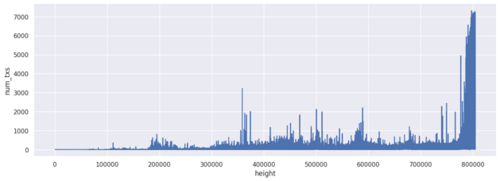

#### Chainstate Parser
Parses Bitcoin's LevelDB UTXO set (chainstate folder) and dumps to a flat sqlite or parquet files

#### Stats/visualization charts

- Check this [notebook](/stats/stats.ipynb)

#### Setup
- Required: >= python3.7
- `pip install -r requirements.txt`
- Shutdown bitcoind and copy chainstate folder inside this package folder
- Setup config.py settings (refer config section below)
- Run `python chainstate.py`
- The parsed data can be saved down to a single sqlite table or a single parquet file. 
- For this parquet with compression uses 50% of the storage of sqlite so much easier if you prefer to load entire utxo set in memory at once.
- You can load it back in python/dataframes or use [SQLite browser](https://sqlitebrowser.org/) for sqlite to query

#### Config.py
> **Warning**: processing time: ~110M leveldb rows, parses at ~10-30k rows/second on a 3 year old laptop (depends on the machine specs)
- MAX_ROWS (int): set max rows to parse(useful for debugging to run quickly), set None to disable limit
- OUTPUT_FORMAT (str): parquet/sqlite/both, file format of output db file. 
- BATCH_SIZE (int): num of rows to append/write in batches to the output db
- PARTITION (bool): partitions output db files by block height(keeps file sizes under 1GB)

---
#### References:
- https://github.com/in3rsha/bitcoin-chainstate-parser
- https://github.com/proger/utxo-dump
- https://github.com/jimmysong/programmingbitcoin
- https://discovery.ucl.ac.uk/id/eprint/10063357/1/utxo_analysis-v2.pdf